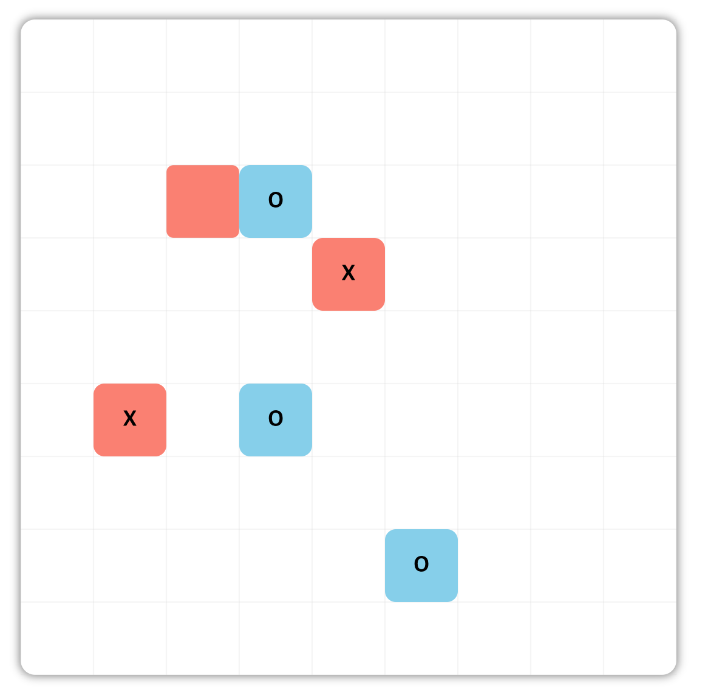

# Outline

- TicTacToc의 디자인을 따 만든 simple한 사목게임을 구현
- typescript, styled-components를 통해 구현하였으며, 애니메이션 효과는 framer-motion을 styled-components와 함꼐 사용하여 구현

   
   

## To Start

> 1. clone this repository
> 2. npm install
> 3. npm run start

 
 

## Used Library

 

 
 

## File Structure

- [Types/](./src/Types)
  - [index.d.ts](./src/Types/index.d.ts)
- [components/](./src/components)
  - [Board/](./src/components/Board)
  - [Button/](./src/components/Button)
  - [Cell/](./src/components/Cell)
  - [Modal/](./src/components/Modal)
  - [StartPage/](./src/components/StartPage)
  - [index.ts](./src/components/index.ts)
- [constant/](./src/constant)
  - [variants.ts](./src/constant/variants.ts)
- [styles/](./src/styles)
  - [globalStyle.ts](./src/styles/globalStyle.ts)
  - [style.d.ts](./src/styles/style.d.ts)
  - [theme.ts](./src/styles/theme.ts)
- [utils/](./src/utils)
  - [checkGameEnd.ts](./src/utils/checkGameEnd.ts)
- [App.tsx](./src/App.tsx)
- [index.tsx](./src/index.tsx)
- [react-app-env.d.ts](./src/react-app-env.d.ts)
- [reportWebVitals.ts](./src/reportWebVitals.ts)
- [setupTests.ts](./src/setupTests.ts)

 
<br/ >

# 구현사항

## 1) 시작 페이지

- 시작 플레이어오 O, X를 선택하는 창 생성
- 선택후 Start 클릭 시 GIF처럼 페이지가 빨려 들어가며, 게임보드가 Pop되도록 애니메이션 추가

 

## 2) 게임 페이지

- TicTacToc의 디자인과 사목의 게임룰을 접목시켜 구현
- 칸에 커서를 hover시킨 경우, 현재 차례에 해당하는 색상이 보이도록 함
- 클릭 시, 게임보드처럼 Pop되는 애니메이션 추가
- 이 때, Cell이 Pop되는 경우 턴이 바뀌어 다른 색상이 보이는 현상이 발생하지 않도록 처리 _(styled components)_

 

## 3) 종료

- 상하좌우, 또는 대각선으로 4개의 같은 모양이 생겼을 경우 게임이 종료되며 위와 같이 모달이 생성
